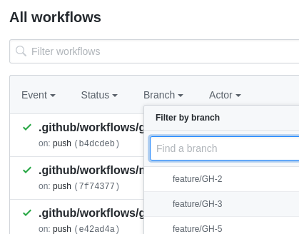

# Development

## How to contribute

1. Create an issue that you are going to address in [GH Issues](https://github.com/shalb/cluster.dev/issues), for example issue `#3`.


2. Spawn new branch from master named with the GH Issue you are going to address: `gh-3`.

3. To start a new cluster corresponding to your issue, create a manifest file in `.cluster.dev/gh-3.yaml`, setting the name with the target issue:

```yaml
cluster:
  name: gh-3 #CHANGE ME
  installed: true
  cloud:
    provider: aws
    region: eu-central-1
    vpc: default
    domain: shalb.net
  provisioner:
    type: minikube
    instanceType: m5.large
```

**Attention:** Branch name (ex. `gh-3`) should be same as cluster manifest file name (ex. `gh-3.yaml`). Otherwise, you need create your own workflow, based on `.github/workflows/working_branches.yaml`

4. Commit and push file with the comment, for example: `GH-3 Initial Commit`. GitHub automatically [creates reference](https://help.github.com/en/github/writing-on-github/autolinked-references-and-urls#issues-and-pull-requests) to the related issue to let other contributors know that related work has been addressed somewhere else.

5. Check the logs in [GH Actions](https://github.com/shalb/cluster.dev/actions) to track the environment building process. To do this, choose your branch in the workflows section and choose your last build.  
  

6. Check the cluster status with your target cloud provider.

7. After you have made all the necessary changes, open a Pull Request and assign it to [@voatsap](https://github.com/voatsap) or [@MaxymVlasov](https://github.com/MaxymVlasov) for the review.

8. After successful review, squash and merge your PR to master with the included comment `Resolve GH-3`.

9. After merging be sure to delete all the resources associated with the issue (ec2 instances, elastic ip's, etc.) that have been used for testing.
