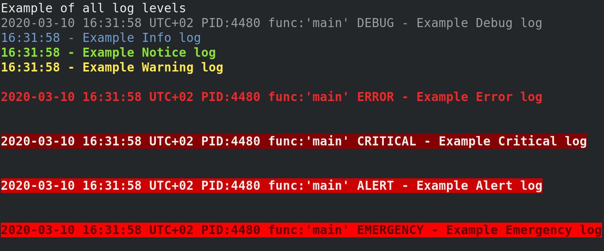

# Bash Logger

Fork of Bash Logger designed to incorporate [PSR-3](http://www.php-fig.org/psr/psr-3/) compliance.

## Contributors

* Dean Rather
* Fred Palmer
* Maksym Vlasov

## Using Bash Logger

**source** the *bash-logger.sh* script at the beginning of any Bash program.

```bash
#!/bin/bash
source ./bin/bash-logger.sh

INFO "This is a test info log"
```

> Function names are in CAPS as not to conflict with the `info` function and `alert` aliases.

## An Overview of Bash Logger

### Colorized Output



### Logging Levels

Bash Logger supports the logging levels described by [RFC 5424](http://tools.ietf.org/html/rfc5424).

* **DEBUG** Detailed debug information.
* **INFO** Interesting events. Examples: User logs in, SQL logs.
* **NOTICE** Normal but significant events.
* **WARNING** Exceptional occurrences that are not errors. Examples:  
  Use of deprecated APIs, poor use of an API, undesirable things that are not necessarily wrong.
* **ERROR** Runtime errors that do not require immediate action but should typically be logged and monitored.
* **CRITICAL** Critical conditions. Example: Application component unavailable, unexpected exception.
* **ALERT** Action must be taken immediately. Example: Entire website down, database unavailable, etc. This should trigger the SMS alerts and wake you up.
* **EMERGENCY** Emergency: system is unusable.

You can set minimum log level by `VERBOSE_LVL` environment variable. Default to `DEBUG`

## Handlers

By default:

* Logs are displayed in colour
* **error** level logs and above `exit` with an error code

The colours, logfile, default behavior, and log-level behavior can all be overwritten, see [examples.sh](https://github.com/deanrather/bash-logger/blob/master/examples.sh) for examples.

## Development information

* Basic usage: `DEBUG "log message"
* Redefine log format: `DEBUG "msg" "%DATE - %MESSAGE"`  
  Existing format parameters:
  * `%MESSAGE` - log message
  * `%LEVEL` - log level
  * `%PID` - Process ID
  * `%DATE` - Date and/or time
  * `%FUNC_TRACE` - Function trace from main function to executed in format `function_with_trouble <- some_func <- main`
* Redefine date format: `DEBUG "msg" "+%T"`  
  Date format same as in `date` command
* Remove from function trace last function name: `DEBUG "msg" "" "" 1`  
  This need for logging inside wrapper function.  
  Can be set to number greater or equal `0`.
