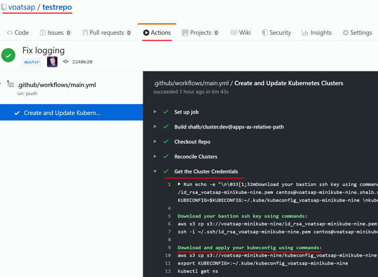

# Getting started on AWS

## Deploying to AWS

Create a separate repository for the infrastructure code that will be managed by `cluster.dev` in GitHub. This repo will host code for your clusters, deployments, applications and other resources. Clone the repo locally:

    ```bash
    git clone https://github.com/YOUR-USERNAME/YOUR-REPOSITORY
    cd YOUR-REPOSITORY
    ```

**Next steps** should be done inside that repo.

2. Create a new AWS user with limited access in IAM and apply the policy [aws_policy.json](https://github.com/shalb/cluster.dev/blob/master/install/installer/aws_policy.json). For details on how to gather required permissions see the [AWS IAM permissions](#aws-iam-permissions).

    The resulting pair of access keys should look like:

    ```yaml
    AWS_ACCESS_KEY_ID = ATIAAJSXDBUVOQ4JR
    AWS_SECRET_ACCESS_KEY = SuperAwsSecret
    ```

3. Add credentials to you repo Secrets under GitHub's repo setting `Settings → Secrets`, the path should look like `https://github.com/MY_USER/MY_REPO_NAME/settings/secrets`:

    

4. In your repo, create a Github workflow file: [.github/workflows/main.yml](https://github.com/shalb/cluster.dev/blob/master/.github/workflows/main.yml) and cluster.dev example manifest: [.cluster.dev/aws-minikube.yaml](https://github.com/shalb/cluster.dev/blob/master/.cluster.dev/aws-minikube.yaml) with the cluster definition.

    _Or download example files to your local repo clone using the next commands:_

    ```bash
    # Sample with Minikube cluster
    export RELEASE=v0.3.3
    mkdir -p .github/workflows/ && wget -O .github/workflows/main.yml "https://raw.githubusercontent.com/shalb/cluster.dev/${RELEASE}/.github/workflows/aws.yml"
    mkdir -p .cluster.dev/ && wget -O .cluster.dev/aws-minikube.yaml "https://raw.githubusercontent.com/shalb/cluster.dev/${RELEASE}/.cluster.dev/aws-minikube.yaml"
    ```

5. In the cluster manifest (.cluster.dev/aws-minikube.yaml) you can set your own Route53 DNS zone. If you don't have any hosted public zone you can set just `domain: cluster.dev` and we will create it for you. Or you can create it manually with [instructions from AWS Website](https://docs.aws.amazon.com/Route53/latest/DeveloperGuide/CreatingHostedZone.html).

6. You can change all other parameters or leave default values in the cluster manifest. Leave the Github workflow file [.github/workflows/main.yml](https://github.com/shalb/cluster.dev/blob/master/.github/workflows/main.yml) as is.

7. Copy a sample of [ArgoCD Applications](https://argoproj.github.io/argo-cd/operator-manual/declarative-setup/#applications) from [/kubernetes/apps/samples](https://github.com/shalb/cluster.dev/tree/master/kubernetes/apps/samples) and [Helm chart](https://helm.sh/docs/topics/charts/) samples from [/kubernetes/charts/wordpress](https://github.com/shalb/cluster.dev/tree/master/kubernetes/charts/wordpress) to the same paths into your repo.

    _Or download application samples directly to local repo clone with the commands:_

    ```bash
    export RELEASE=v0.3.3
    # Create directory and place ArgoCD applications inside
    mkdir -p kubernetes/apps/samples && wget -O kubernetes/apps/samples/helm-all-in-app.yaml "https://raw.githubusercontent.com/shalb/cluster.dev/${RELEASE}/kubernetes/apps/samples/helm-all-in-app.yaml"
    wget -O kubernetes/apps/samples/helm-dependency.yaml "https://raw.githubusercontent.com/shalb/cluster.dev/${RELEASE}/kubernetes/apps/samples/helm-dependency.yaml"
    wget -O kubernetes/apps/samples/raw-manifest.yaml "https://raw.githubusercontent.com/shalb/cluster.dev/${RELEASE}/kubernetes/apps/samples/raw-manifest.yaml"
    # Download sample chart which with own values.yaml
    mkdir -p kubernetes/charts/wordpress && wget -O kubernetes/charts/wordpress/Chart.yaml "https://raw.githubusercontent.com/shalb/cluster.dev/${RELEASE}/kubernetes/charts/wordpress/Chart.yaml"
    wget -O kubernetes/charts/wordpress/requirements.yaml "https://raw.githubusercontent.com/shalb/cluster.dev/${RELEASE}/kubernetes/charts/wordpress/requirements.yaml"
    wget -O kubernetes/charts/wordpress/values.yaml "https://raw.githubusercontent.com/shalb/cluster.dev/${RELEASE}/kubernetes/charts/wordpress/values.yaml"
    ```

    Define path to ArgoCD apps in the [cluster manifest](https://github.com/shalb/cluster.dev/blob/master/.cluster.dev/aws-minikube.yaml):

    ```yaml
      apps:
        - /kubernetes/apps/samples
    ```

8. Commit and Push files to your repo.

9. Set the cluster to `installed: true`, commit, push and follow the Github Action execution status, the path should look like `https://github.com/MY_USER/MY_REPO_NAME/actions`. In the GitHub action output you'll receive access instructions to your cluster and services:  
    

10. Voilà! You receive GitOps managed infrastructure in code. So now you can deploy applications, create more clusters, integrate with CI systems, experiment with the new features and everything else from Git without leaving your IDE.
