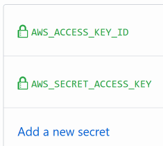

# Cluster.dev - Kubernetes-based Dev Environment in Minutes

Cluster.dev is an open-source system delivered as GitHub Action or Docker Image 
for creating and managing Kubernetes clusters with simple manifests by GitOps approach.   

Designed for developers that are bored to configure Kubernetes stuff
and just need: kubeconfig, dashboard, logging and monitoring out-of-the-box.  

Based on DevOps and SRE best-practices. GitOps cluster management and application delivery.
Simple CICD integration. Easily extandable by pre-configured applications and modules. 
Supports different Cloud Providers and Kubernetes versions.

----
## Principle diagram


## How it works

In background:

 - Terraform creates a "state bucket" in your Cloud Provider account where all infrastructure objects would be stored. Typically it is defined on Cloud Object Storage like AWS S3.
 - Terraform modules creates Minikube/EKS/GKE/etc.. cluster, VPC and DNS zone within your Cloud Provider.
 - ArgoCD Continuous Deployment system deployed inside Kubernetes cluster. Enables you to deploy your applications from raw manifests, helm charts or kustomize yaml's.
 - GitHub CI runner deployed into your Kubernetes cluster and used for your apps building CI pipelines with GitHub Actions.

You receive:

 - Automatically generated kubeconfig, ssh-access, and ArgoCD UI url’s
 - Configured: Ingress Load Balancers, Kubernetes Dashboard, Logging(ELK), Monitoring(Prometheus/Grafana)  

## Quick Start

 1. Dedicate a separate repository for infrastructure that would be managed by `cluster.dev`. This repo would host code for your clusters, deployments and other resources managed GitOps way.  
 Next steps should be done in that repo.

 2. Obtain access credentials for your cloud account.
 For example, in AWS it is called "Programmatic Access user",and looks like: 
 ```yaml
 aws_access_key_id =  ATIAAJSXDBUVOQ4JR
 aws_secret_access_key = SuperAwsSecret
 ```
 3. Add credentials to you repo's Secrets under GitHub's: "Settings->Secrets", ex: 
 

 4. Create a new cluster.dev config yaml with your cluster definition: `.cluster.dev/minikube-a.yaml` :
 ```yaml
cluster:
  name: minikube-a
  cloud: 
    provider: aws
    region: eu-central-1
    vpc: default
    domain: shalb.net # Your domain in Route53
  provisioner:
    type: minikube
    instanceType: m5.large
 ```   
 
 4. Create a Github Workflow file `.github/workflows/main.yml` :

```yaml
on: [push]
jobs:
  deploy_cluster_job:
    runs-on: ubuntu-latest
    name: Deploy and Update K8s Cluster
    steps:
    - name: Checkout Repo
      uses: actions/checkout@v2
    - name: Reconcile Clusters
      id: reconcile
      uses: shalb/cluster.dev@master
      with:
     # Change setting below with path to config and creds
        cluster-config: './.cluster.dev/minikube-a.yaml' 
        cloud-user: ${{ secrets.aws_access_key_id }}
        cloud-pass: ${{ secrets.aws_secret_access_key }}
     # end of chages
    - name: Get the execution status
      run: echo "The status ${{ steps.reconcile.outputs.status }}"
```

5. Commit and Push changes and follow the Github Action execution and in its output you'll receive access instructions to your cluster and its services.

## Roadmap 

The project is in Alpha Stage, the first release is planned on 14 February 2020.
Roadmap details: [ROADMAP.md](./roadmap/)

## Contributing 

If you want to spread the project with your own code, you can start contributing with this quick guide: [CONTRIBUTING.md](./contributing/)
